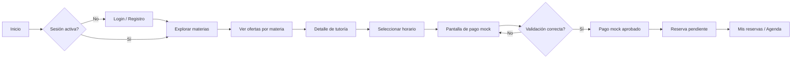
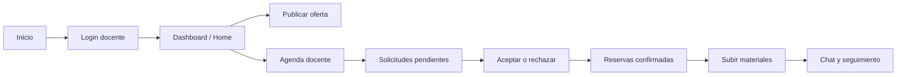

# Flujo de uso — Tutorias

## Reglas principales

- Las rutas privadas usan una sesión centralizada para evitar validaciones dispersas y parpadeos.
- La reserva de estudiante ya no crea una solicitud antes del pago: primero valida horario, luego abre el pago mock y después crea la reserva con `paymentStatus: paid_mock`.
- El modo offline conserva caché local, cola de sincronización y avisos visuales. Las operaciones que requieren pago se bloquean con un mensaje claro cuando no hay conexión.
- El pago mock no almacena datos sensibles completos: solo conserva metadatos simulados y los últimos cuatro dígitos.
